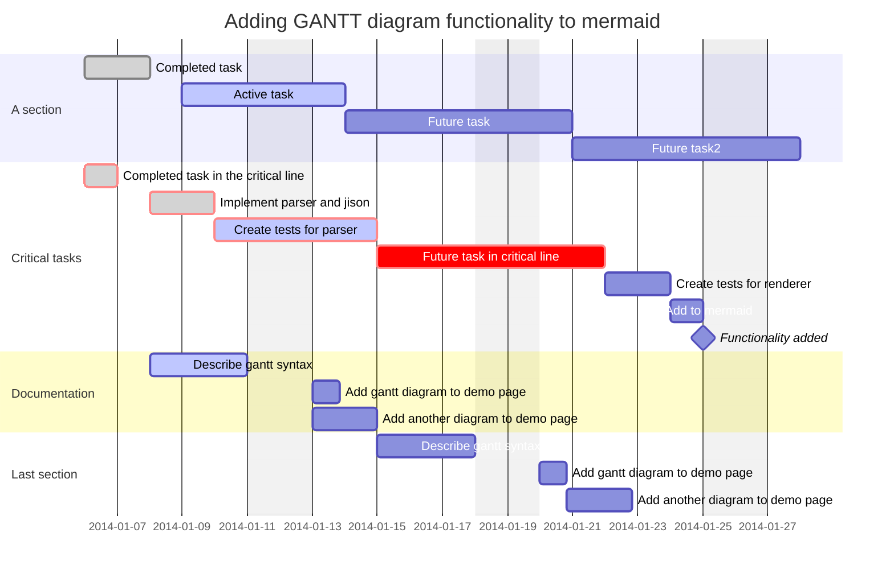
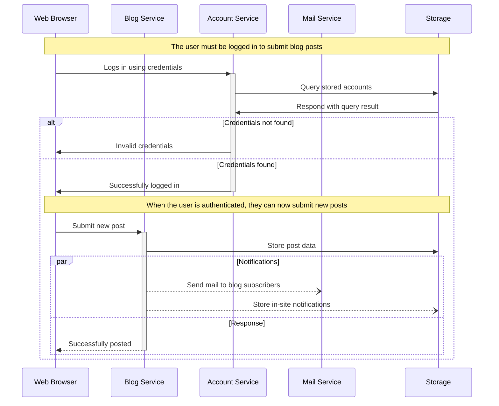
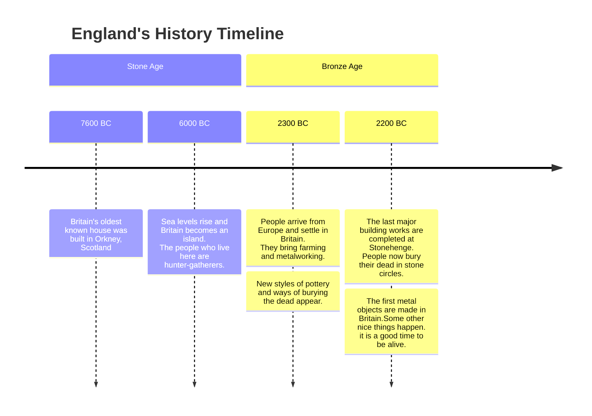

# Testing the Markdown copilot

## Table of contents

- [Heading examples](#heading-examples)
- [Tasks](#tasks)
- [Table example](#table-example)
- [Mermaid JS gantt](#mermaid-js-gantt)
- [Mermaid JS sequence diagram](#mermaid-js-sequence-diagram)
- [Mermaid JS flowchart](#mermaid-js-flowchart)
- [Basic flowchart](#basic-flowchart)
- [Mermaid JS user story](#mermaid-js-user-story)
- [Mermaid JS class diagram](#mermaid-js-class-diagram)
- [Mermaid JS entity relationship diagram](#mermaid-js-entity-relationship-diagram)
- [Markdown features examples](#markdown-features-examples)

## Heading examples
### H1
## H2
### H3
#### H4
##### H5
###### H6

## Tasks

- [ ] Task 1
- [x] Task 2
- [x] Task 3
- [ ] Task 4

## Table example
<html>
    <body  >
        <table style="width: 100%;">
            <thead>
                <tr>
                    <th>Layer 1</th>
                    <th>Layer 2</th>
                    <th>Layer 3</th>
                </tr>
            </thead>
            <tbody>
                <tr>
                    <td rowspan=4>L1 Name</td>
                    <td rowspan=2>L2 Name A</td>
                    <td>L3 Name A</td>
                </tr>
                <tr>
                    <td>L3 Name B</td>
                </tr>
                <tr>
                    <td rowspan=2>L2 Name B</td>
                    <td>L3 Name C</td>
                </tr>
                <tr>
                    <td>L3 Name D</td>
                </tr>
                <tr>
                    <td colspan=3>Merged</td>
                </tr>
                <tr>
                    <td>L1 Second</td>
                    <td>L2 Second</td>
                    <td>L3 Second</td>
                </tr>
            </tbody>
        </table>
    </body>
</html>

## Mermaid JS gantt



## Mermaid JS sequence diagram



## Mermaid JS flowchart


## Basic flowchart

```mermaid
graph LR
    swimlane A
    A[Activity] -- Link text --> B((Circle))
    A --> C[Activity]
    end
    B --> D{Decision}
    C --> D --> E
    C --> E{Decision}
    E --> F[Activity]
    E --> G[Activity]
    G --> F

```

## Mermaid timeline example



## Mermaid JS user story


## Mermaid JS class diagram


## Mermaid JS entity relationship diagram


## Markdown features examples

### Unordered List examples

- Item 1
  - Item 2
- Item 3
  - Item 4
  - Item 5
    - Item 6

### Ordered List examples

1. Item 1
    1. Item 2
2. Item 3
    1. Item 4
    2. Item 5
        1. Item 6

### Code examples

#### JSON

```json
{
    "name": "John",
    "age": 30,
    "city": "New York",
    "hasChildren": false,
    "titles": [
        "engineer",
        "programmer",
        "designer"
    ],
    "address": {
        "street": "123 Main St",
        "city": "New York",
        "state": "NY",
    }
}
```

#### YAML

```yaml
name: John
age: 30
city: New York
hasChildren: false
titles:
  - engineer
  - programmer
  - designer
address:
  street: 123 Main St
  city: New York
  state: NY
```

#### JAVA BPMN

```java
public class MyProcess {
    public static void main(String[] args) {
        System.out.println("Hello World!");
        System.exit(0);
    }
}
```

### HTML examples

```html
<html>
    <body>
        <h1>Hello World</h1>
        <p>This is my first paragraph.</p>
    </body>
</html>
```

### Formatted text

```text
Hello World
This is my first paragraph.
```
